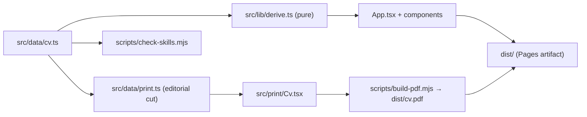

# Architecture

How the CV at perepages.com is built. It explains *how* things work. The rules that follow from
it are in [principles.md](principles.md), the reasons for each choice in
[decisions.md](decisions.md), the security surface in [security.md](security.md), and open
work in [tasks.md](tasks.md). When code and this file disagree, the code is right and this
file is a bug.

## Shape

A static site: React 19 · TypeScript 7 (strict) · Vite 8 · Sass, no CSS framework. Two HTML entry
points share one data file and nothing else:

- `index.html` → `src/main.tsx` → `App.tsx` — the site, served at the apex of `perepages.com`.
- `print.html` → `src/print/main.tsx` → `Cv.tsx` — the paper edition, never visited directly;
  `scripts/build-pdf.mjs` renders it to `dist/cv.pdf` in headless Chromium.

Colour, the foundation tokens (space, radius, motion, typefaces, type floors, focus rings), the
theme mechanism and one component (`IconButton`) come from the family packages
`@pearpages/pulp-tokens` and `@pearpages/pulp-react`; the footer signature from
`@pearpages/credit`. Fonts are self-hosted through `@fontsource*`. There is no runtime backend.

## Modules

| Path | Owns |
|---|---|
| `src/data/` | `cv.ts` (all content), `types.ts`, `print.ts` (the PDF's editorial cut) |
| `src/lib/derive.ts` | Every computed value: durations, time axis, `axisTicks`, `skillSource()` |
| `src/components/` | One folder per section (`Hero`, `Nav`, `About`, `Experience`, `Skills`, `Projects`, `Writing`, `Community`, `Education`, `References`, `Contact`, `Footer`, `Section`), each `.tsx` + co-located `.scss`; `icons/` holds inline SVG components |
| `src/hooks/` | `useTheme` (the toggle), `useActiveSection` (nav highlight, IntersectionObserver) |
| `src/styles/` | `layers.css` (cascade order), `_reset`, `_tokens` (what pulp lacks — fluid type growth, leading, tracking, `--space-9`, layout — plus aliases for the site's own colours), `_typography`, `_print` (the blanking rule), `index.scss` |
| `src/print/` | The paper edition: `Cv.tsx` is structure, `print.scss` is the design |
| `scripts/` | `check-skills.mjs` (the two-way skills gate), `build-pdf.mjs` (render + five gates) |
| `public/` | `CNAME`, `manifest.json`, `service-worker.js` (self-unregistering no-op), `media/` (mark, favicons, `og-card.png`) |
| `og-card.html` | Source for `public/media/og-card.png`; not part of the build |

## Data flow

`src/data/cv.ts` is the single source of content, typed by `src/data/types.ts`. `derive.ts`
computes everything else, purely.

- `from`/`to` are ISO `YYYY-MM`; `to` may be `'present'`. `Role.to` is **not always the transition
  month** — WeFitter (`2016-10 → 2017-04`) deliberately overlaps AngularCamp by a month, converted
  from the source's inclusive months. See the note on the type.
- `PRESENT` resolves against `new Date()`, so durations ending in it (e.g. `ocado-payments`) grow
  every month.
- `stack` is a `string[]` per role and per project, and one of the three things that can back a
  skill claim; `writing.topics` is the third.
- `repo` on a `ShowcaseProject` is optional. Four entries have none: Bitepals (private repo), the
  two client sites `Consulting Integral Garrotxa` and `Trainingacció`, and `Blog` (a Docusaurus
  install). The About sidebar's "Open source" count is `projects.filter(p => p.repo).length` and
  renders as "12 of 16 projects".
- The two client sites are the only commercial work in `projects` and sit at the top; their
  descriptions say "client site" outright. `This CV` is listed last and backs Playwright and GitHub
  Actions; `This CV` and `Podcast` back most of the skills found in the repository sweep.
- `writing.postCount` is a hand-written snapshot (78, 11 Aug 2026); `writing.selected` is three
  hand-picked posts. No build-time RSS fetch.

### Skills

The section is **keyword surface and navigation, not proof**
([ADR-0004](docs/adr/0004-skills-are-keyword-surface-not-proof.md)). Each skill links to the
section that backs it via `skillSource()` → `'projects' | 'writing' | 'experience'`, preferring
externally checkable evidence (package or repo > post > work-history line). The chips are not
dressed as links: the affordance appears only on hover and focus.

`scripts/check-skills.mjs` runs three checks ([ADR-0005](docs/adr/0005-two-way-skills-gate.md)):
claim → backing; backing → claim (or a reasoned entry in `DELIBERATELY_UNCLAIMED`); and no stale
exclusions. `Docusaurus` is enforced there; WordPress is only described.

### Time axis

Segments are positioned with `--offset`/`--length` custom properties computed in `derive.ts`.
Ticks carry their own `offset` from the same `axisSpan()` the bars use, so labels and bars cannot
drift; the last label is `is-trailing` (`translateX(-100%)`) because `.time-axis` clips. Every
segment sits at the same `inset-block-start`, so overlapping bars stack rather than lane; the fill
mixes with `var(--color-surface-base)` rather than `transparent` so two stacked bars don't compound into a
brighter sliver. A longer overlap would need real laning.

## The two acts

- **Act I** — `Hero`, fixed behind the document: a full-viewport ultramarine field with the name
  at ~18vw. Archivo's width axis (`wdth` 62–125) is driven by scroll via CSS
  `animation-timeline: scroll(root block)`, guarded by `@supports`, static under
  `prefers-reduced-motion`. Archivo comes from `@fontsource-variable/archivo/wdth.css`.
- **Act II** — the document scrolls over it (`.page { margin-block-start: 100dvh }`) on a light,
  quiet reading surface where the ultramarine is demoted from ground to accent.

`--ultramarine` is the site's own because Act I paints it as a *ground* and it must not lift in
the dark scheme the way `--color-action-primary` does; the hero is `--ultramarine` on `--bone` in
both schemes. `--logo-chip` exists because opaque PNG logos turn into solid blocks when inverted
(see `Role.scss`).

The pearpages mark (`public/media/pearpages-mark.png`) appears three times: ~52px above the
wordmark, 24px in the nav, 22px in the footer credit (sized by `@pearpages/credit`, which ships it
as a data URI). Below `56rem` the nav hides the *name*, not the mark. The nav is hidden until the
document covers the hero, with `visibility: hidden` alongside `opacity: 0` so its links leave the
tab order.

The footer is `<Credit as="div" />`; its stylesheet is imported in `main.tsx` ahead of the site's.
`Footer.scss` maps `--sk-ink-soft`/`--sk-accent` to pulp tokens (the package's `#667` fallback
fails contrast in dark), sets the left alignment, and restores the underline the reset strips.

## The theme

The scheme follows the OS until the reader chooses
([ADR-0009](docs/adr/0009-theme-follows-os-until-chosen.md)).

- Every colour is a `light-dark()` pair; pulp sets `color-scheme` from `data-scheme` (read
  alongside `data-brand="pulp"`). With no `data-scheme`, `prefers-color-scheme` decides.
- `src/hooks/useTheme.ts` and pulp's `IconButton` in `Nav.tsx` set or clear the attribute and keep
  the single `theme-color` meta in step with the *resolved* theme.
- The inline classic script in `index.html`'s `<head>`, below the `theme-color` meta, applies a
  stored choice before Vite's stylesheet (appended at the end of `<head>`) exists. That ordering
  is the whole anti-flash mechanism.
- The two hex values in `index.html` and `useTheme.ts` mirror pulp's `--color-action-primary`
  (light) and `--color-surface-base` (dark). `public/manifest.json`'s `theme_color` pins the light
  value; no manifest media mechanism ships anywhere.
- The toggle is unreachable during Act I by design: nothing on screen there changes with scheme.

## The paper edition

`perepages.com/cv.pdf` is a separate one-page A4 document
([ADR-0006](docs/adr/0006-paper-edition-separate-html-document.md)). `scripts/build-pdf.mjs`
starts a Vite preview server on port 4177, loads `print.html` in Playwright's Chromium, measures
the layout, prints, and checks the bytes. `src/print/` shares nothing with `src/styles/`; the two
stylesheet graphs are disjoint. The skills block has four rows (no *Practice* row — the summary
carries the leadership), and the Ocado tenure is merged into one.

**Measuring wraps.** `data-oneline` marks text that must not wrap; three mechanics make the
measurement correct, and each was got wrong first:

1. `Element.getClientRects()` returns one rect per line only for *inline* elements; a block always
   returns 1. Measure a `Range` over the element's contents instead.
2. One line produces several rects, one per inline child, and children at different font sizes
   sit at different `top`s on the same line. Merge vertically-overlapping rects into bands and
   count bands.
3. `.cv` is pinned to `width: 170mm`, the `@page` content box; otherwise the DOM lays out at
   browser width and every measurement describes a layout that is never printed.

**Gates.** The build fails if the document exceeds one page, if any `data-oneline` element wraps,
if anything overflows the page box, if a font lands as Type 3, or if the MediaBox is not A4.

## Site printing

`_print.scss` is a blanking rule: `@media print` hides `body > *` and prints one quiet line,
`perepages.com/cv.pdf` ([ADR-0007](docs/adr/0007-site-printing-disabled.md)). The nav's
**Download CV** anchor is commented out in `Nav.tsx`, with its `.nav__print` rule in `Nav.scss`
(uncomment both or neither; the anchor goes *before* `.nav__theme`). `.print-only` markup in
`Footer.tsx`, `Contact.tsx` and `References.tsx`, and `no-print` on `.nav`, are inert and kept.
The previous ⌘P stylesheet is in git history.

## Build, test, deploy

- **Build:** `npm run build` = `check:skills` → `vite build` → `build-pdf.mjs`. `npm run typecheck`
  is separate and gates the deploy. There are no tests; the gates are the test suite.
- **Deploy** ([ADR-0010](docs/adr/0010-deploy-on-version-tags.md)): only a `vX.Y.Z` tag deploys.
  `npm version patch|minor|major` bumps, commits and creates an annotated tag;
  `git push --follow-tags` deploys. `.github/workflows/deploy.yml` refuses a tag not on `master`
  (fails, never skips), installs Chromium (cached on the lockfile hash), typechecks, builds, and
  publishes `dist/` with `deploy-pages`. `workflow_dispatch` re-deploys an existing tag.
- **Repo settings not visible in this tree:** Pages is on `build_type: "workflow"` (the `source`
  field still reports `master` `/docs` and is ignored); the `github-pages` environment allows tags
  `v*.*.*` only.
- `base: '/'` in `vite.config.ts`; `public/CNAME` (`perepages.com`) travels inside the artifact.
- `public/service-worker.js` unregisters itself and deletes all caches, flushing the 2017
  webpack-era worker. Leave it until returning visitors have cycled.
- `index.html` loads the footfall analytics tag (self-hosted Umami at `analytics.pearpages.com`).
- Version line: pre-2026 tags were deleted in Sep 2026; it restarts at `v2.0.0`, the rebrand. An
  `origin/gh-pages` branch survives from an earlier setup and is referenced by nothing.
